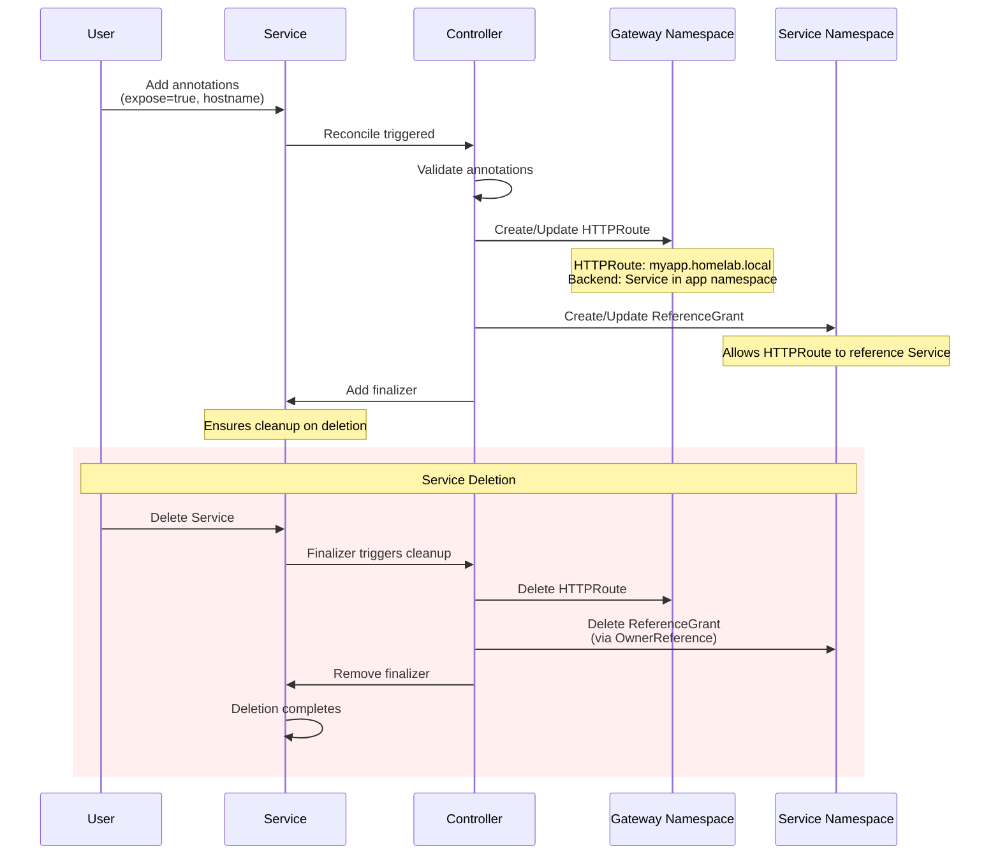

# HTTPRoute Controller

[](https://goreportcard.com/report/github.com/Piotr1215/httproute-controller)
[](https://opensource.org/licenses/MIT)
[](https://github.com/Piotr1215/httproute-controller/releases/latest)
[](https://hub.docker.com/r/piotrzan/httproute-controller)
[](https://scorecard.dev/viewer/?uri=github.com/Piotr1215/httproute-controller)
[](https://slsa.dev)

Kubernetes controller that automatically generates Gateway API HTTPRoutes from Service annotations.

## Overview

Convenience controller for creating HTTPRoutes. Watches Services with specific annotations and auto-generates HTTPRoute + ReferenceGrant resources, eliminating manual YAML creation for each exposed service.

**Built with:**
- Kubebuilder v4.5.1
- Gateway API v1.2.1
- Controller-runtime v0.20.2

## Architecture

**Controller Name:** `homelab.local/httproute-controller`

**Reconciliation:**
- Level-based triggers (reconciles full state)
- Idempotent operations
- OwnerReferences for same-namespace resources
- Finalizers for cross-namespace cleanup

**Constraints:**
- HTTPRoute must be in gateway namespace (Kubernetes blocks cross-namespace OwnerReferences)
- ReferenceGrant must be in service namespace
- HTTPS only (targets gateway `https` section)
- Single service per HTTPRoute (no aggregation)

## Features

**Annotation-driven automation:**
- Watches Services with `gateway.homelab.local/expose: "true"`
- Auto-generates HTTPRoute + ReferenceGrant from annotations
- No manual resource creation required

**Cross-namespace security:**
- HTTPRoute deployed in gateway namespace (e.g., `envoy-gateway-system`)
- Service remains in application namespace (e.g., `default`)
- ReferenceGrant enables secure cross-namespace backend references
- Prevents unauthorized Service access from other namespaces

**Lifecycle management:**
- Finalizers ensure HTTPRoute cleanup when Service is deleted
- OwnerReferences auto-delete ReferenceGrant with Service
- Removing `expose: "true"` triggers resource cleanup
- Idempotent reconciliation (safe to run multiple times)

**Configuration:**
- Gateway name/namespace configurable per Service
- Defaults: `homelab-gateway` in `envoy-gateway-system`
- Port selection: explicit annotation or first Service port
- HTTPS-only (targets gateway's `https` section)

### Controller Lifecycle



## Usage

### Annotations

| Annotation | Required | Default | Description |
|------------|----------|---------|-------------|
| `gateway.homelab.local/expose` | Yes | - | Set to `"true"` to enable |
| `gateway.homelab.local/hostname` | Yes | - | DNS hostname (e.g., `myapp.homelab.local`) |
| `gateway.homelab.local/gateway` | No | `homelab-gateway` | Gateway name |
| `gateway.homelab.local/gateway-namespace` | No | `envoy-gateway-system` | Gateway namespace |
| `gateway.homelab.local/port` | No | First port | Service port |

### Example

```yaml
apiVersion: v1
kind: Service
metadata:
  name: myapp
  namespace: default
  annotations:
    gateway.homelab.local/expose: "true"
    gateway.homelab.local/hostname: "myapp.homelab.local"
spec:
  selector:
    app: myapp
  ports:
  - port: 80
    targetPort: 8080
```

**Controller automatically creates:**

1. **HTTPRoute** (in gateway namespace):
   - Name: `default-myapp`
   - Hostname: `myapp.homelab.local`
   - Backend: Service `myapp` in namespace `default`
   - Cleanup via Service finalizer (cross-namespace OwnerRefs not supported)

2. **ReferenceGrant** (in service namespace):
   - Name: `myapp-backend`
   - Allows HTTPRoute from gateway namespace to reference Service
   - OwnerReference to Service (automatic garbage collection)

## Installation

### Using Helm (Recommended)

**From Helm repository:**

```sh
helm repo add httproute-controller https://piotr1215.github.io/httproute-controller
helm repo update
helm install httproute-controller httproute-controller/httproute-controller \
  --namespace httproute-system \
  --create-namespace
```

**From GitHub release:**

```sh
# Replace v0.3.5 with the desired version
helm install httproute-controller \
  https://github.com/Piotr1215/httproute-controller/releases/download/v0.3.5/httproute-controller-0.3.5.tgz \
  --namespace httproute-system \
  --create-namespace
```

**From source:**

```sh
helm install httproute-controller ./helm/httproute-controller \
  --namespace httproute-system \
  --create-namespace
```

### Using kubectl

```sh
kubectl apply -f https://raw.githubusercontent.com/Piotr1215/httproute-controller/main/dist/install.yaml
```

## Development

### Prerequisites
- go v1.23.0+
- kubectl v1.11.3+
- Access to a Kubernetes cluster
- Gateway API CRDs installed

### Local Development

**Install Gateway API CRDs:**
```sh
make install
```

**Run controller locally:**
```sh
make run
```

**Run tests:**
```sh
make test
```

**Build and test in cluster:**
```sh
# Create KIND cluster
kind create cluster --name httproute-test

# Install Gateway API CRDs
kubectl apply -f config/crd/gateway-api/gateway-api-crds.yaml

# Build image
make docker-build IMG=httproute-controller:local

# Load image to KIND
kind load docker-image httproute-controller:local --name httproute-test

# Deploy controller
make deploy IMG=httproute-controller:local

# Run integration tests
make test-e2e

# Cleanup
kind delete cluster --name httproute-test
```

**Uninstall:**
```sh
make undeploy
make uninstall
```

## Release

Releases are automated via GitHub Actions. To create a new release:

```sh
git tag -a v0.2.0 -m "Release v0.2.0"
git push origin v0.2.0
```

The release pipeline automatically:
1. Builds and pushes multi-platform Docker images to `piotrzan/httproute-controller`
2. Packages the Helm chart with correct version metadata
3. Generates `install.yaml` bundle
4. Creates GitHub release with artifacts
5. Updates Helm repository index on GitHub Pages

**Release artifacts:**
- Docker image: `piotrzan/httproute-controller:<version>`
- Helm chart: Available from GitHub releases and Helm repository
- Install bundle: `dist/install.yaml`

## Security

### Image Verification

All container images are signed with Cosign using keyless signing (GitHub OIDC).

**Verify image signature:**
```sh
cosign verify \
  --certificate-identity-regexp="https://github.com/Piotr1215/httproute-controller/.*" \
  --certificate-oidc-issuer="https://token.actions.githubusercontent.com" \
  piotrzan/httproute-controller:0.3.5
```

**View SBOM:**
```sh
docker scout sbom piotrzan/httproute-controller:0.3.5
```

**View provenance attestation:**
```sh
cosign verify-attestation \
  --type slsaprovenance \
  --certificate-identity-regexp="https://github.com/Piotr1215/httproute-controller/.*" \
  --certificate-oidc-issuer="https://token.actions.githubusercontent.com" \
  piotrzan/httproute-controller:0.3.5 | jq .
```

## License

MIT License - see [LICENSE](LICENSE) file for details.

