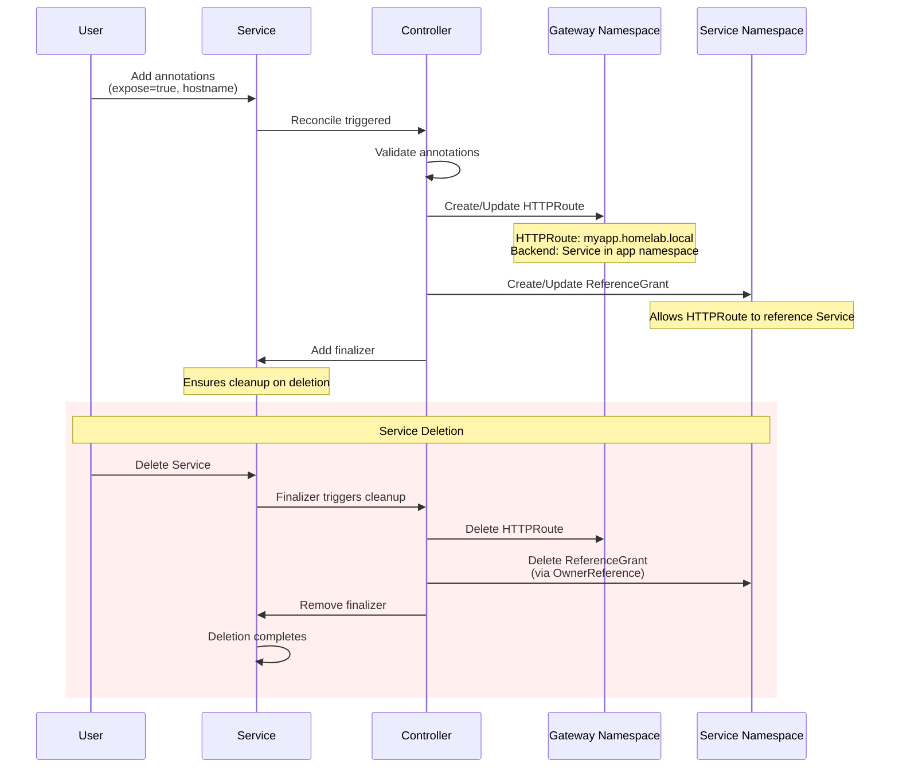

# HTTPRoute Controller

Kubernetes controller that automatically generates Gateway API HTTPRoutes from Service annotations.

## Overview

Convenience controller for creating HTTPRoutes. Watches Services with specific annotations and auto-generates HTTPRoute + ReferenceGrant resources, eliminating manual YAML creation for each exposed service.

**Built with:**
- Kubebuilder v4.5.1
- Gateway API v1.2.1
- Controller-runtime v0.20.2

## Architecture

**Controller Name:** `homelab.local/httproute-controller`

**Reconciliation:**
- Level-based triggers (reconciles full state)
- Idempotent operations
- OwnerReferences for same-namespace resources
- Finalizers for cross-namespace cleanup

**Constraints:**
- HTTPRoute must be in gateway namespace (Kubernetes blocks cross-namespace OwnerReferences)
- ReferenceGrant must be in service namespace
- HTTPS only (targets gateway `https` section)
- Single service per HTTPRoute (no aggregation)

## Features

**Annotation-driven automation:**
- Watches Services with `gateway.homelab.local/expose: "true"`
- Auto-generates HTTPRoute + ReferenceGrant from annotations
- No manual resource creation required

**Cross-namespace security:**
- HTTPRoute deployed in gateway namespace (e.g., `envoy-gateway-system`)
- Service remains in application namespace (e.g., `default`)
- ReferenceGrant enables secure cross-namespace backend references
- Prevents unauthorized Service access from other namespaces

**Lifecycle management:**
- Finalizers ensure HTTPRoute cleanup when Service is deleted
- OwnerReferences auto-delete ReferenceGrant with Service
- Removing `expose: "true"` triggers resource cleanup
- Idempotent reconciliation (safe to run multiple times)

**Configuration:**
- Gateway name/namespace configurable per Service
- Defaults: `homelab-gateway` in `envoy-gateway-system`
- Port selection: explicit annotation or first Service port
- HTTPS-only (targets gateway's `https` section)

### Controller Lifecycle



## Usage

### Annotations

| Annotation | Required | Default | Description |
|------------|----------|---------|-------------|
| `gateway.homelab.local/expose` | Yes | - | Set to `"true"` to enable |
| `gateway.homelab.local/hostname` | Yes | - | DNS hostname (e.g., `myapp.homelab.local`) |
| `gateway.homelab.local/gateway` | No | `homelab-gateway` | Gateway name |
| `gateway.homelab.local/gateway-namespace` | No | `envoy-gateway-system` | Gateway namespace |
| `gateway.homelab.local/port` | No | First port | Service port |

### Example

```yaml
apiVersion: v1
kind: Service
metadata:
  name: myapp
  namespace: default
  annotations:
    gateway.homelab.local/expose: "true"
    gateway.homelab.local/hostname: "myapp.homelab.local"
spec:
  selector:
    app: myapp
  ports:
  - port: 80
    targetPort: 8080
```

**Controller automatically creates:**

1. **HTTPRoute** (in gateway namespace):
   - Name: `default-myapp`
   - Hostname: `myapp.homelab.local`
   - Backend: Service `myapp` in namespace `default`
   - OwnerReference to Service (for cleanup)

2. **ReferenceGrant** (in service namespace):
   - Name: `myapp-backend`
   - Allows HTTPRoute from gateway namespace to reference Service
   - OwnerReference to Service (automatic garbage collection)

## Installation

### Using Helm (Recommended)

```sh
helm install httproute-controller ./helm/httproute-controller \
  --namespace httproute-system \
  --create-namespace
```

### Using kubectl

```sh
kubectl apply -f https://raw.githubusercontent.com/Piotr1215/httproute-controller/main/dist/install.yaml
```

## Development

### Prerequisites
- go v1.23.0+
- kubectl v1.11.3+
- Access to a Kubernetes cluster
- Gateway API CRDs installed

### Local Development

**Install Gateway API CRDs:**
```sh
make install
```

**Run controller locally:**
```sh
make run
```

**Run tests:**
```sh
make test
```

**Build and test in cluster:**
```sh
# Build and push image
make docker-build docker-push IMG=<your-registry>/httproute-controller:tag

# Deploy to cluster
make deploy IMG=<your-registry>/httproute-controller:tag
```

**Uninstall:**
```sh
make undeploy
make uninstall
```

## Release

### Build installer bundle

```sh
make build-installer IMG=ghcr.io/piotr1215/httproute-controller:v0.1.0
```

Generates `dist/install.yaml` with all resources.

### Package Helm chart

```sh
helm package ./helm/httproute-controller -d dist/
```

## License

MIT License - see [LICENSE](LICENSE) file for details.

